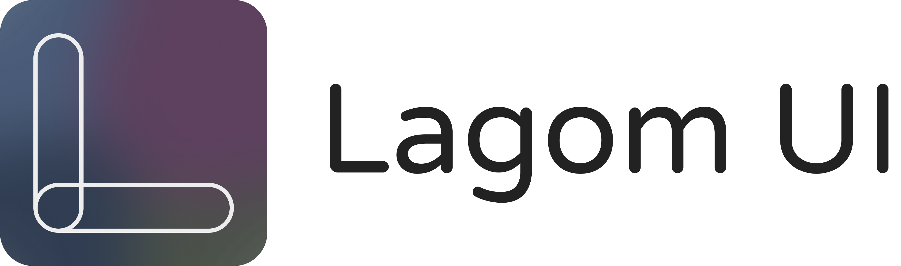

[**Lagom**](https://en.wikipedia.org/wiki/Lagom) (pronounced [ˈlɑ̂ːɡɔm]) is a Swedish and Norwegian word meaning "just the right amount".

This component library provides just the right amount of components for my own personal projects. Primarily driven by FrankCongson.com. With theme support for individually styled projects.

Built using [styled components](https://styled-components.com/) and [Styled System](https://styled-system.com/).

## Inspiration

[Customization vs. Configuration in Evolving Design Systems](https://engineering.atspotify.com/2021/04/28/customization-vs-configuration-in-evolving-design-systems/)

[Open Design Systems](https://www.designsystems.com/open-design-systems/)

[Design Systems Repo](https://designsystemsrepo.com/design-systems)

## References

[Styled System API](https://styled-system.com/api)

[Styled System Theme Specification](https://styled-system.com/theme-specification)
