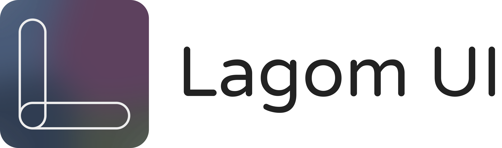

[**Lagom**](https://en.wikipedia.org/wiki/Lagom) (pronounced [ˈlɑ̂ːɡɔm]) is a Swedish and Norwegian word meaning "just the right amount".

This component library provides just the right amount of components for my own personal projects. Primarily driven by FrankCongson.com. With theme support for individually styled projects.

Styled with plain CSS and [design tokens](https://github.com/fcongson/lagom-tokens).

Ships as dual ESM + CJS (Node >= 20), with `react`/`react-dom` as peer dependencies.

## Usage

```
import { Button } from "@fcongson/lagom-ui";
import "@fcongson/lagom-ui/style.css"; // once, anywhere in your app entry
import "@fcongson/lagom-tokens/css/theme/_light.css"; // pick a theme (or both)
import "@fcongson/lagom-tokens/css/theme/_dark.css";
```

Component styling isn't CSS-in-JS, so it isn't auto-injected - import lagom-ui's stylesheet once alongside your first component import. lagom-ui doesn't bundle a [lagom-tokens](https://github.com/fcongson/lagom-tokens) theme for you either, so pick whichever theme(s) your app needs.

## Inspiration

[Customization vs. Configuration in Evolving Design Systems](https://engineering.atspotify.com/2021/04/28/customization-vs-configuration-in-evolving-design-systems/)

[Open Design Systems](https://www.designsystems.com/open-design-systems/)

[Design Systems Repo](https://designsystemsrepo.com/design-systems)
